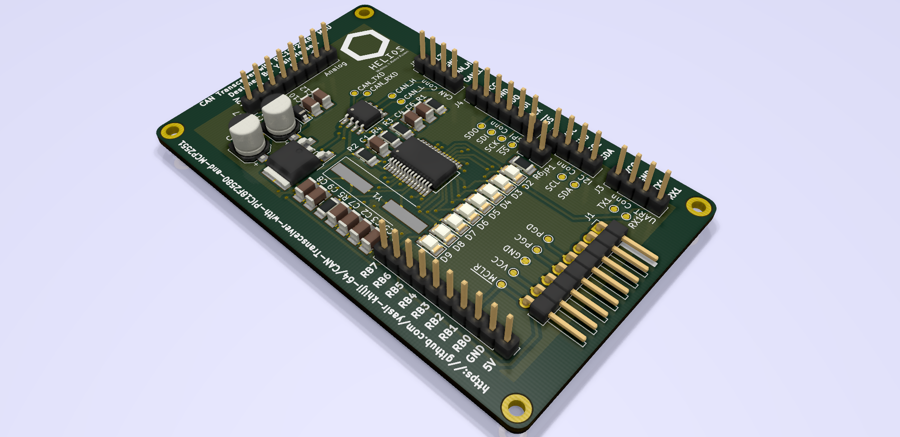

# CAN Transceiver with PIC18F2580 and MCP2551

<h2 align="center"><strong>Developed by Helios LLC</strong></h2>

## Development
Current version is **v2.0**. The device uses **PIC18F25K80** as the base MCU. Other chips include **MCP2551 High-Speed CAN Transceiver**. Board is developed for students who are learning Electronics Design and PCB Design. 

---

---
## Built With
* [KiCad 5.0](http://kicad-pcb.org) - PCB Design Tool